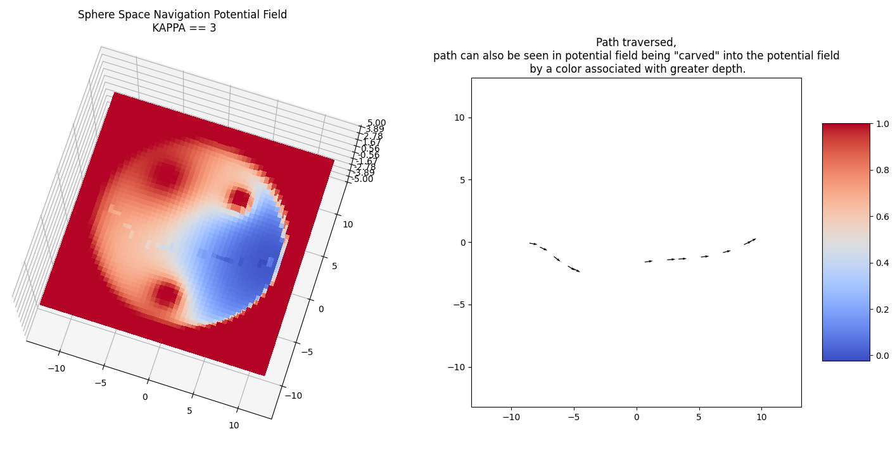
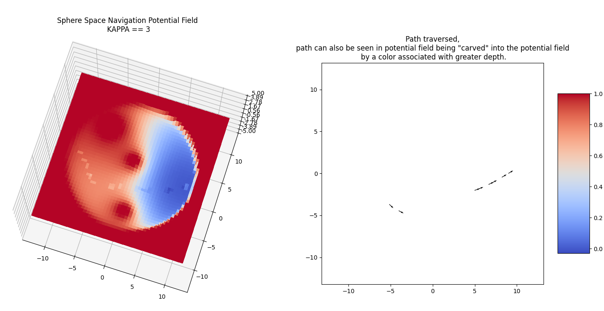

# sphere_space_navigation
The main SphereSpaceNavigation implementation using matplotlib.

The navigation is potential field based.
* New locations are chosen via gradient descent.


The Sphere Space Navigation is based on the following [paper](https://kodlab.seas.upenn.edu/uploads/Kod/Rimon92.pdf) 

```
E Rimonand D Koditschek. “Exact robot navigation using artificial potential functions”. 1992.
```
### Project Implementation in ROS

I put together an implementation of it (on Friday March 5th) using a skid steer based robot, the repo for that can be found [here](https://github.com/1hada/skid_steer_bot).


# Sphere Space Navigation Test

The demos you'll see will show :





## Prerequisites

1. Python3

```sh
sudo apt install python-pip3 -y
pip3 install -r requirements.txt
```

## Run the Code

In a terminal window, type the following,
```sh
python3 sphere_space_navigation.py
```


Enjoy :)
